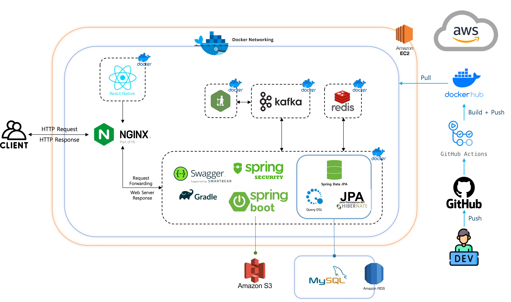

# 의류재고 떨이 & 리폼 플랫폼

## 프로젝트 개요

### 문제 정의
- 현대 사회에서는 패션 트렌드의 빠른 변화와 소비자들의 다양한 요구로 인해 의류 산업이 크게 성장하고 있다. 하지만 이러한 성장은 그림자를 동반하고 있다. 의류 폐기물이 급증함에 따라 점주들은 많은 손해를 입고 있으며, 환경 오염 문제도 심각해지고 있다.
- 의류 제작 및 폐기가 환경 오염에 끼치는 영향에 대해서 의류/섬유 산업의 순환 경제로의 전환을 위한 연구를 진행한 논문을 인용하면 의류의 환경 영향은 폐기 단계뿐만 아니라 생산 과정에서 도 온실가스 배출, 수질 오염 등을 비롯한 높은 환경 오염을 보이며, 티셔츠 한 벌 생산에 필요 한 물의 양은 2,700L, 청바지는 7,000L이다. 의류 산업에서 배출하는 탄소 배출량은 전체의 10% 에 해당하며, 염료와 표백제 사용으로 산업 수질 오염 비중은 20%, 1차 미세 플라스틱 오염 비 중은 35%인 것으로 조사되었다
- 특히 악성 재고나 시즌 오프 의류들이 적절히 처리되지 못하는 것이 주요 문제 중 하나이며, 이러한 문제는 단순히 판매자와 소비자 간의 경제적인 문제를 넘어서 환경적인 차원에서 우리 사회에 심각한 부담을 가하고 있다.
- 이러한 문제를 해결하기 위해 새로운 처리 방식과 기술이 절실하게 필요하다.

### 프로젝트 목표
- 의류 폐기물로 인한 환경 오염을 줄이는 것과 점주들에게 경제적인 부담을 완화 하는 것이다. 의류 떨이 서비스를 통해 악성 재고를 처리하고, 상품을 재활용 및 개조하여 지속 가능한 소비와 생산을 촉진하며, 판매자, 디자이너, 구매자에게 상호 간의 혜택을 제공한다.
- 판매자는 재고 관리 및 악성 재고 처리에 용이해지고 플랫폼을 통한 디자이너와의 연결이 수월해진다.
- 구매자는 악성 재고를 저렴하게 구매할 수 있고, 플랫폼을 통해 구매와 리폼을 동시에 진행할 수 있다.
- 디자이너는 리폼 시장 활성화로 인한 수익 창출 기회가 확대되고 경험을 쌓을 수 있는 현장을 제공받는다.

## 프로젝트 소개

### 리폼 흐름도

### 주요 기능

## 기술 스택

### 기술 스택

OS |  
--- | --- |
Frontend |     
Backend |       
Database |  
Server |     
CI/CD |   
Development Tools |  
Framework | 
Version Control |  
Communication |     

### 시스템 아키텍쳐

## 팀 소개

||||||
|:-:|:-:|:-:|:-:|:-:|
|이정필 [@jungpill](https://github.com/jungpill)|김경호 [@sgn07124](https://github.com/sgn07124)|손혁 [@SonHyeok](https://github.com/SonHyeok)|양준규 [@YJKBigBo](https://github.com/YJKBigBo)|고한동 [@YJKBigBo](https://github.com/YJKBigBo)|
